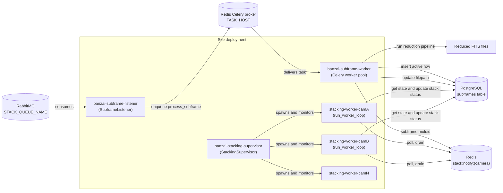
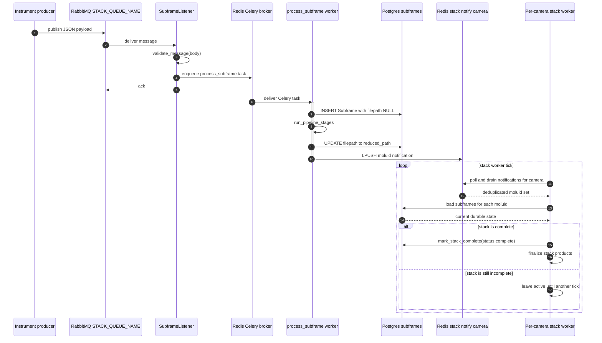
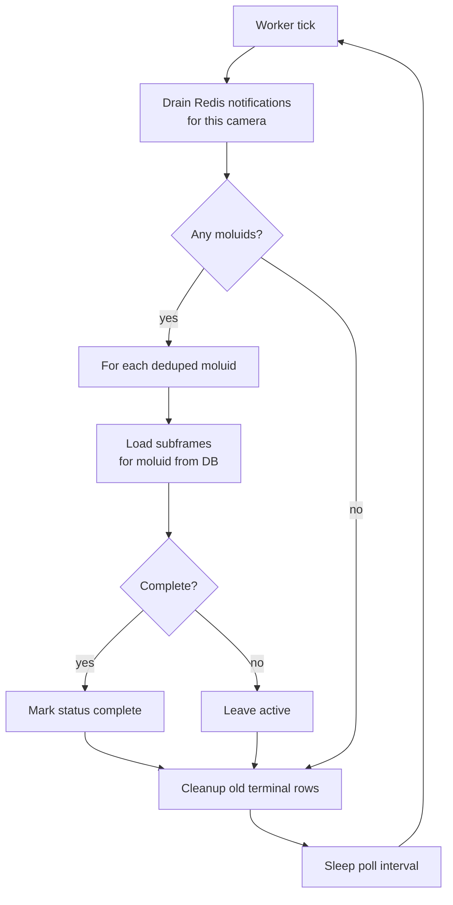

# Smart Stacking Architecture

**Status:** in progress on `feature/separate-site-deps`
**Scope:** subframe ingestion → reduction → per-camera coordination → finalized stack

This document describes the process layout and message flow for the
smart-stacking subsystem deployed at each observatory site.
It aims to give a clearer picture of *who runs what*, *how completion is
signalled*, and *why the current implementation uses RabbitMQ plus two Redis
roles*.

---

## 1. Process layout

Three long-running services cooperate at each site, plus the shared
infrastructure they depend on. Boxes are OS processes or process groups.
Arrows show the main runtime relationships and state changes.

**Process responsibilities at a glance:**

| Process | Entry point | Role |
|---------|-------------|------|
| `banzai-subframe-listener` | `banzai.main:run_subframe_worker` | RabbitMQ consumer; validates payload, dispatches Celery task. |
| `banzai-subframe-worker` | Celery worker on `SUBFRAME_TASK_QUEUE_NAME` | Runs `process_subframe`: insert row, reduce frame, update row, notify stack workers through Redis. |
| `banzai-stacking-supervisor` | `banzai.stacking:run_supervisor` | Discovers cameras at site; spawns and monitors one worker per camera. |
| `stacking-worker-{camera}` | `banzai.stacking:run_worker_loop` (`multiprocessing` child) | Coalesces per-camera notifications and decides when a stack is complete. |

Cameras are discovered once at supervisor startup from
`dbs.get_instruments_at_site(site_id)`. Each per-camera worker is a separate OS
process so a crash in one camera's loop doesn't affect the others; the
supervisor restarts crashed workers.

---

## 2. Subframe → stack sequence

This is what happens when a single subframe arrives and ultimately triggers
stack finalization. The inbound subframe
payload is consumed from RabbitMQ, the reduction task is delivered by Celery
through `TASK_HOST`, and notifications of new subframes being ready go
through a Redis list.

- The DB row is inserted **before** reduction starts, so the stacking worker
  can see "subframe N has arrived but is not yet reduced" (`filepath = NULL`).
- The Redis notification is pushed **after** the filepath is updated, so when
  the stacking worker drains and queries, it observes the post-reduction
  state.
- `drain_notifications` uses `RENAME` + `LRANGE` + `DEL` to atomically swap
  the list, so notifications pushed during a drain aren't lost.
- Multiple subframes for the same moluid collapse into a single drained
  notification — the worker queries the DB for the full state of the stack,
  not the contents of the notification.

---

## 3. Worker tick and cleanup

The complete-stack path is notification-driven in the current implementation:
the worker polls Redis, then queries the DB for each notified `moluid`. If a
stack is still incomplete, its rows remain `active` until another notification
arrives.

Timeout finalization is intentionally deferred. A follow-up change should add
adaptive timeout handling based on subframe arrival cadence, using DB insert
times and exposure duration rather than a fixed stack age.

`retention_days` defaults to 30 (see `stacking._stacking_worker_arg_parser` for
the current default). Cleanup only removes terminal rows, so incomplete stacks
remain active until completed by a later notification or finalized by future
timeout handling.

---

## 4. Design rationale: why RabbitMQ and Redis?

The current implementation uses RabbitMQ for the inbound site queue and Redis for
two separate roles:

- **RabbitMQ (`STACK_QUEUE_NAME`)** carries inbound subframe messages from the
  producer to `SubframeListener`. The listener validates each payload, submits
  a Celery task, then acks the RabbitMQ message.

- **Redis as Celery broker (`TASK_HOST`)** carries the `process_subframe`
  Celery tasks consumed by `banzai-subframe-worker`.

- **Redis (`stack:notify:{camera}`)** carries *coalesced state-change
  notifications*. The stacking worker does not need to see every individual
  subframe — it needs to know "the state of moluid X may have changed,
  re-query the DB." If three subframes for the same moluid arrive within one
  poll interval, we want to handle them as **one** decision, not three.
  `drain_notifications` collapses duplicates with a `set`, which is
  effectively free with Redis lists + `RENAME`.

- **The DB is the source of truth.** The notification path converges on
  `get_subframes(moluid)` and the `check_stack_complete` predicate. The
  notification only tells the worker *when to look*; it does not carry
  decision-making state.

The important caveat is that the current implementation still depends on the
Redis notification list for complete-stack detection. If a completion
notification is lost, active rows can remain active indefinitely. A more robust
version would either add a DB fallback for complete-ready stacks or remove the
notification list entirely and discover actionable stacks directly from the DB.

### Alternatives we did not take

- **Single Celery task per "stack maybe complete" event.** Would force
  per-frame fan-out (no coalescing) and put decision logic on workers that
  don't have per-camera affinity. We'd have to add a per-moluid lock to
  prevent races, which is exactly what the per-camera worker process already
  gives us for free.
- **PostgreSQL `LISTEN/NOTIFY` instead of Redis.** Workable, but coalescing
  is harder (every NOTIFY is delivered) and it couples notification
  semantics to whichever DB session is open. Redis lists are a more natural
  fit for "drain whatever's accumulated since I last looked."
- **Pure polling (no Redis at all).** Simpler, but each worker would have
  to poll the DB at a rate fast enough to feel responsive. This is likely the
  simplest operational model if the query is scoped by camera/status and backed
  by an appropriate index.

If the supervisor/worker architecture ever needs to go away entirely, the natural
endpoint is a Celery task on subframe-completion that does the
`check_stack_complete` decision inline, plus a separate periodic Celery beat
task for timeout/fallback discovery. That is a larger refactor and explicitly
out of scope for the initial smart-stacking PR.

---

## 5. Data model: `subframes`

Defined in `banzai/dbs.py` as `Subframe`. Unique constraint on
`(moluid, stack_num)`.

| Column | Type | Purpose |
|--------|------|---------|
| `moluid` | str | Stack group identifier (FITS `MOLUID`). |
| `stack_num` | int | Position in stack (FITS `MOLFRNUM`). |
| `frmtotal` | int | Expected subframe count (FITS `FRMTOTAL`). |
| `camera` | str | Camera identifier (FITS `INSTRUME`). |
| `filepath` | str / NULL | Path to the reduced subframe; NULL until reduction completes. |
| `is_last` | bool | Instrument signalled the final subframe of the sequence. |
| `status` | str | `'active'`, `'complete'`, or `'timeout'`. |
| `dateobs` | datetime | Observation timestamp (FITS `DATE-OBS`). |
| `created_at` | datetime | Row creation time. |
| `completed_at` | datetime / NULL | Set when `status` transitions to `'complete'` or `'timeout'`. |

A stack is **complete** when every received subframe has a non-null filepath
AND either `len(subframes) == frmtotal` OR `any(is_last)` — see
`stacking.check_stack_complete`.

---

## 6. Code map

| File | Contains |
|------|----------|
| `banzai/main.py` | `SubframeListener`, `run_subframe_worker` entry point. |
| `banzai/scheduling.py` | `process_subframe` Celery task. |
| `banzai/stacking.py` | `validate_message`, `check_stack_complete`, `drain_notifications`, `run_worker_loop`, `StackingSupervisor`, `run_supervisor`. |
| `banzai/dbs.py` | `Subframe` model, `insert_subframe`, `update_subframe_filepath`, `get_subframes`, `mark_stack_complete`, `cleanup_old_subframes`. |
| `banzai/settings.py` | `SUBFRAME_TASK_QUEUE_NAME`, `STACK_QUEUE_NAME`, `REDIS_URL`, `RABBITMQ_URL`. |
| `docker-compose-site.yml` | `banzai-subframe-listener`, `banzai-subframe-worker`, `banzai-stacking-supervisor` services. |
| `pyproject.toml` | `banzai_subframe_worker`, `banzai_stacking_supervisor` console entry points. |
| `banzai/tests/test_smart_stacking.py` | Coverage for DB operations, status transitions, notifications, completion logic, listener dispatch, and supervisor spawning. |
