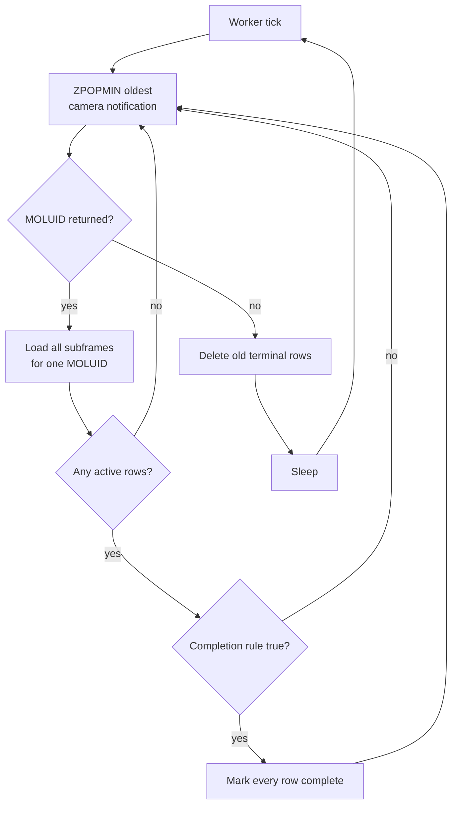
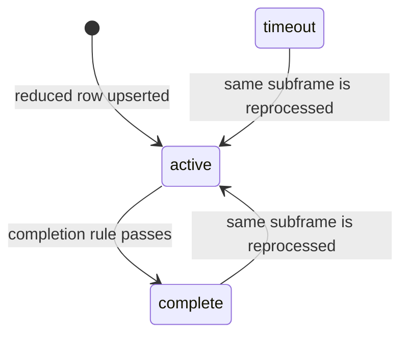

# Smart Stacking Architecture

**Implementation status:** orchestration scaffolding is in place. BANZAI reduces
subframes, records them, detects complete groups, and marks those groups
complete. It does **not yet create a stacked FITS file, JPEG preview, or archive
upload**.

This document describes the smart-stacking code as it exists today. It is
intended to answer four questions for a new developer:

1. What problem does this subsystem solve?
2. Which process owns each part of the work?
3. Where is state stored, and what triggers a completion check?
4. Which parts are still placeholders?

## The short version

A smart stack is a set of reduced `e09` subframes with the same FITS `MOLUID`.
Those subframes begin as raw `e00` files. The eventual combined stack is
expected to be an `e45` product, but that output does not exist yet.

The system uses two asynchronous steps:

1. A listener receives a path to a raw subframe and sends reduction work to
   Celery.
2. After reduction succeeds, a per-camera stacking worker is notified. It
   reloads the group from PostgreSQL and checks whether the stack is complete.

PostgreSQL is the source of truth. Redis notifications only mean:

> Something changed for this `MOLUID`; query the database again.

When a group is complete, the current implementation changes its database
status to `complete`. The function is named `finalize_stack`, but product
creation is still represented by mock log messages.


```mermaid
flowchart LR
    producer["Instrument or test producer<br/>raw e00 FITS"]
    rabbit["RabbitMQ<br/>incoming subframe queue"]
    listener["SubframeListener"]
    celery_broker["Redis<br/>Celery broker"]
    reduction["Celery process_subframe task"]
    files["Reduced e09 FITS files"]
    db[("PostgreSQL<br/>subframes")]
    notify["Redis<br/>per-camera notifications"]
    stack_worker["Per-camera stacking worker"]

    producer -->|"JSON containing a file path"| rabbit
    rabbit --> listener
    listener -->|"enqueue reduction"| celery_broker
    celery_broker --> reduction
    reduction --> files
    reduction -->|"upsert reduced subframe"| db
    reduction -->|"notify after DB write"| notify
    notify --> stack_worker
    stack_worker -->|"reload group and update status"| db
```

## Terminology

| Term | Meaning |
|------|---------|
| **Subframe** | One exposure that belongs to a multi-frame observing group. |
| **Stack** | All `subframes` rows sharing a `MOLUID`. |
| **`MOLUID`** | Identifier used to group subframes into one stack. |
| **`MOLFRNUM`** | A subframe's position within the stack. |
| **`FRMTOTAL`** | Expected number of subframes in the stack. |
| **`last_frame`** | Queue-message flag saying the producer considers this the final subframe. It is stored as `is_last`. |
| **Notification** | A member of a per-camera Redis sorted set containing a `MOLUID`; it is a prompt to query PostgreSQL. |
| **Finalization** | Currently, marking all rows for a `MOLUID` terminal in the database. It does not yet produce a stacked image. |

### File types and reduction levels

The shorthand `e00`, `e09`, and `e45` refers to the exposure file's
reduction-level suffix, not to different FITS container formats. For this
workflow:

| Suffix | Reduction level | Meaning in smart stacking |
|--------|-----------------|---------------------------|
| `e00` | Raw / `RLEVEL=0` | Raw subframe received from the instrument, for example `...-e00.fits.fz`. Raw files may omit `RLEVEL`; BANZAI treats them as level 0. |
| `e09` | `RLEVEL=9` | Individually reduced subframe written by `process_subframe` and stored in `subframes.filepath`. The site listener selects this level with `--rlevel=9`. |
| `e45` | `RLEVEL=45` | Planned final image produced by combining the reduced `e09` subframes. No `e45` product is currently generated. |

The queue message and FITS file provide different information:

- The JSON message contains `fits_file` and `last_frame`. Producers may include
  extra metadata such as their enqueue timestamp; BANZAI ignores it.
- The FITS header supplies `MOLUID`, `MOLFRNUM`, `FRMTOTAL`, `INSTRUME`, and
  `DATE-OBS`.
- `fits_file` is a path, not file contents. The reduction worker must be able to
  read that path through the site's shared filesystem mounts.

## Happy path

### 1. Receive and dispatch

`SubframeListener` consumes `STACK_QUEUE_NAME` from RabbitMQ.

It decodes the body as a JSON object and checks that the three required message
fields are present. A valid message is submitted to the Celery queue named by
`SUBFRAME_TASK_QUEUE_NAME`, then acknowledged on RabbitMQ.

Malformed JSON and messages missing required fields are logged, acknowledged,
and discarded. Validation checks field presence only; FITS metadata is read
later by the Celery task.

### 2. Reduce and record

The Celery `process_subframe` task:

1. Opens the raw `e00` FITS header from `fits_file`.
2. Runs the normal BANZAI reduction pipeline.
3. Computes the reduced `e09` output path.
4. Upserts a `subframes` row.
5. Adds the row's `MOLUID` to the Redis notification sorted set for its camera.

The database write happens only after reduction returns an output image, and
the notification happens only after the database write. A stacking worker
therefore treats every notified group as having reduced `e09` input ready to
inspect.

Notification insertion uses an atomic Redis script. If the `MOLUID` is not
already pending, the script increments `stack:notify:{camera}:sequence` and
uses that sequence as the member's score. If the `MOLUID` is already pending,
the script leaves its original score unchanged. Duplicate notifications are
therefore coalesced without moving an older group behind newer work.

The unique key is `(moluid, stack_num)`. Reprocessing the same subframe updates
that row and resets it to `active`, which makes queue retries idempotent at the
database level.

### 3. Recheck the stack

`StackingSupervisor` starts one OS process per camera. Each process repeatedly:

1. Removes the oldest pending `MOLUID` with `ZPOPMIN`.
2. Loads all rows for that `MOLUID` from PostgreSQL.
3. Skips the notification if every row is already terminal.
4. Checks the completion rule when at least one row is active.
5. Marks a complete group as `complete`.
6. Repeats from step 1 until the sorted set is empty.
7. Deletes old terminal rows according to the retention setting.
8. Sleeps for the polling interval.

The worker does not build stack state from Redis messages. Ten notifications
for the same pending `MOLUID` become one sorted-set member and one database
query. Multiple `MOLUID`s may be active for one camera. None exclusively owns
the worker: an incomplete group waits for another notification while older
pending work for other groups continues in FIFO order.


```mermaid
flowchart TD
    tick["Worker tick"]
    pop["ZPOPMIN oldest<br/>camera notification"]
    notified{"MOLUID returned?"}
    load["Load all subframes<br/>for one MOLUID"]
    active{"Any active rows?"}
    complete{"Completion rule true?"}
    mark["Mark every row complete"]
    cleanup["Delete old terminal rows"]
    sleep["Sleep"]

    tick --> pop --> notified
    notified -->|"yes"| load --> active
    active -->|"yes"| complete
    active -->|"no"| pop
    complete -->|"yes"| mark --> pop
    complete -->|"no"| pop
    notified -->|"no"| cleanup
    cleanup --> sleep --> tick
```

### 4. Decide whether the group is complete

`check_stack_complete` returns true when any row has `is_last == true`. This is
the producer's authoritative end-of-sequence signal. `FRMTOTAL` remains the
expected group size for metadata and progress; it does not decide completion.
The predicate trusts the producer and does not independently verify that prior
frame numbers are contiguous.

### 5. "Finalize" the group

`finalize_stack` currently:

- sets every row for the `MOLUID` to `status='complete'`;
- sets `completed_at`; and
- emits debug logs standing in for stacking, JPEG generation, and upload.

There is no combined `e45` FITS product yet. Code that needs a real smart-stack
product must not treat `status='complete'` as proof that one exists. The
intended product flow is:

```text
one or more raw e00 subframes
    -> individually reduced e09 subframes
    -> one combined e45 smart-stack image (planned)
```

## Processes and ownership

| Runtime component | Entry point | Responsibility |
|-------------------|-------------|----------------|
| `banzai-subframe-listener` | `banzai.main:run_subframe_worker` | Consume and validate RabbitMQ messages; dispatch Celery tasks. Despite the CLI name, this is the listener process. |
| `banzai-subframe-worker` | Celery worker consuming `SUBFRAME_TASK_QUEUE_NAME` | Reduce the FITS file, upsert the reduced row, and send a notification. |
| `banzai-stacking-supervisor` | `banzai.main:run_stacking_supervisor` | Discover cameras at startup, start one child per camera, and restart children that exit. |
| `stacking-worker-{camera}` | `banzai.stacking:run_worker_loop` | Process unique notifications in FIFO order, query stack state, mark complete groups, and run retention cleanup. |

Camera discovery uses `dbs.get_instruments_at_site(site_id, db_address)` once
when the supervisor starts. Adding a camera to the database does not create a
worker until the supervisor restarts.

Each camera loop is a separate process, so an unhandled process failure is
isolated and the supervisor can restart that worker. Exceptions raised inside
a normal worker tick are logged by the loop, followed by another attempt after
the polling interval.

## State and messaging

The subsystem uses four storage or transport roles:

| System | Role | Authoritative? |
|--------|------|----------------|
| RabbitMQ | Carries incoming subframe messages to the listener. | No |
| Redis as the Celery broker (`TASK_HOST`) | Carries `process_subframe` tasks to Celery workers. | No |
| Redis notification sorted sets (`REDIS_URL`) | Orders unique prompts for a camera worker to re-query a `MOLUID`. | No |
| PostgreSQL `subframes` table | Stores reduced inputs and stack status. | **Yes** |

The two Redis roles normally point at the same Redis deployment, but they are
logically separate: Celery owns its task data, while smart stacking owns keys
named `stack:notify:{camera}` and sequence counters named
`stack:notify:{camera}:sequence`.

### Why notifications instead of stack state in Redis?

Reduction tasks may finish concurrently and in a different order from the raw
frames. Keeping the durable state in PostgreSQL gives every completion check a
single current view. Redis can then carry only a lightweight change signal
rather than a second copy of stack state.

The per-camera process also serializes completion decisions for that camera in
the normal case, without requiring a lock per `MOLUID`. Redis sequence scores
preserve notification arrival order across concurrent reduction workers. Once
`ZPOPMIN` removes a member, a later notification may add the same `MOLUID`
again with a new score; the next database query will see the latest group
state.

## Database model

`Subframe` is a site-only SQLAlchemy model in
[`banzai/dbs.py`](../banzai/dbs.py).

| Column | Meaning |
|--------|---------|
| `moluid` | Stack group identifier from `MOLUID`. |
| `stack_num` | Position in the stack from `MOLFRNUM`. |
| `frmtotal` | Expected group size from `FRMTOTAL`. |
| `camera` | Camera identifier from `INSTRUME`. |
| `filepath` | Path to the reduced `e09` subframe; it is non-nullable. |
| `is_last` | Copy of the queue message's `last_frame` flag. |
| `status` | Expected values are `active`, `complete`, and `timeout`. |
| `dateobs` | Observation time from `DATE-OBS`, when available. |
| `created_at` | Time the row was inserted or reset by an upsert. |
| `completed_at` | Time the group was marked terminal. |

Current transitions are:


```mermaid
stateDiagram-v2
    [*] --> active: reduced row upserted
    active --> complete: completion rule passes
    complete --> active: same subframe is reprocessed
    timeout --> active: same subframe is reprocessed
```

The model and database helper support `timeout`, but no production worker path
currently sets it.

Retention cleanup deletes rows whose status is not `active` and whose
`completed_at` is older than `STACK_RETENTION_DAYS` (30 days by default).
Active rows are retained indefinitely.

## Current limitations and failure behavior

These details are important when debugging or extending the subsystem:

- **No `e45` stack product is generated.** Completion currently means a
  database transition only; only the individual `e09` inputs exist.
- **No timeout finalization runs.** `STACK_TIMEOUT_MINUTES` remains in
  `site-banzai-env.default`, but the current Python code does not read it.
- **There is no fallback database sweep.** An active stack is reconsidered only
  after a Redis notification for its `MOLUID`. If notification is disabled,
  lost, or missed, the stack remains active until another notification arrives.
- **The in-flight notification has a crash window.** `ZPOPMIN` removes one
  `MOLUID` before its database work begins. A worker crash can lose that one
  notification, but all other members remain ordered in the sorted set.
  PostgreSQL remains correct, but there is currently no sweep to rediscover an
  active stack whose final notification was lost.
- **Cleanup is repeated per camera.** Every camera worker calls the same
  database-wide terminal-row cleanup each tick. This is correct but redundant.
- **Camera discovery is startup-only.** Restart the supervisor after adding or
  removing site instruments.
- **Terminal states are not protected from repeat work.** The normal upsert
  path intentionally resets a duplicate subframe to `active`.

These are descriptions of current behavior, not guarantees the eventual
product-generating design should preserve.

## Deployment configuration

The site deployment is defined in
[`docker-compose-site.yml`](../docker-compose-site.yml). The most relevant
settings are:

| Setting | Used for |
|---------|----------|
| `RABBITMQ_URL` | Passed to the listener as `--broker-url`. |
| `STACK_QUEUE_NAME` | RabbitMQ queue consumed by `SubframeListener`. |
| `TASK_HOST` | Celery broker URL; the compose file sets it from `REDIS_URL`. |
| `SUBFRAME_TASK_QUEUE_NAME` | Celery queue consumed by the subframe worker. |
| `REDIS_URL` | Smart-stacking notification Redis URL. |
| `DB_ADDRESS` | Site database containing `subframes` and instruments. |
| `SITE_ID` | Site whose cameras the supervisor discovers. |
| `STACK_RETENTION_DAYS` | Age after which terminal rows are deleted. |

See [`site-banzai-env.default`](../site-banzai-env.default) for the annotated
site environment template.

Changing `stack:notify:{camera}` from a Redis list to a sorted set requires a
coordinated deployment of notification producers and stacking workers. Stop
both sides and delete only the `stack:notify:*` keys, including any legacy
`:draining` keys, before restarting them. Do not flush the shared Redis
database: it also carries Celery broker state. Pending smart-stacking
notifications removed during this rollout are not reseeded.

## Code map

Start with these files:

| File | What to read |
|------|--------------|
| [`banzai/main.py`](../banzai/main.py) | `decode_subframe_message`, `SubframeListener`, and `run_subframe_worker`. |
| [`banzai/scheduling.py`](../banzai/scheduling.py) | The Celery `process_subframe` reduction task. |
| [`banzai/stacking.py`](../banzai/stacking.py) | Notification helpers, completion predicate, worker loop, placeholder finalization, and supervisor. |
| [`banzai/dbs.py`](../banzai/dbs.py) | `Subframe` plus its insert, query, status, and cleanup helpers. |
| [`banzai/tests/test_smart_stacking.py`](../banzai/tests/test_smart_stacking.py) | Executable examples of the current unit-level behavior. |
| [`banzai/tests/site_e2e/test_site_e2e.py`](../banzai/tests/site_e2e/test_site_e2e.py) | Site test proving message -> reduction -> DB completion. It does not assert a combined stack product. |

Useful commands:

```bash
uv run pytest banzai/tests/test_smart_stacking.py -v
uv run pytest -m smart_stacking
```
