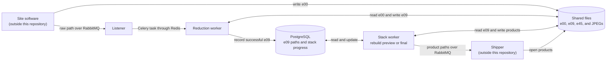

# Smartstack Architecture Design

## About smartstacks

Smartstacks are exposures made from combining a series of shorter exposures. The benefits of this procedure are reduced tracking error and the ability to provide previews of the stacking progress (currently only jpgs) for realtime users as the stack is being processed. Since smartstacks require lots of files, creating the stacks in AWS risks saturating the bandwidth available to observatories. Therefore, smartstacks are designed to be processed with a banzai instance running directly at site, and only the final smartstack products will be sent to the archive.

### Smartstack limitations

Some important caveats, to help understand when smartstacks might not be a useful alternative to regular exposures.

- BANZAI does not align or resample stack members, so sources that move between frames will smear.
- Reproducability is limited. Final e45 products include the frames that were stacked, but these are not sent to the archive and are regularly cleaned from disks at site (after approx. 2 weeks). If the time since e45 creation is less than the site's file retention policy *and* the `STACK_RETENTION_DAYS` param that controls the local db cleanup, stacks can be recreated; otherwise not.
- The combined product's RDNOISE is scaled by sqrt(N) for a stack of N farmes, compared to a single frame with the same total exposure.

Also worth noting: the preview frames are visually stretched, lower-resolution jpg previews that overwrite each other as the stack is updated. They are intended as quick feedback for realtime observers, and not for any sort of data analysis.

_____

This page describes the Smartstack path in `docker-compose-site.yml`. The program that sends raw frames, the shipper, and the archive are outside this repository. The site deployment does not run the normal realtime `e91` path.

The reduction level suffixes used:

- `e00` is a raw exposure.
- `e09` is an exposure reduced using BANZAI's default ordered reduction steps.
- `e45` is the combined Smartstack product.

## The whole path


```mermaid
flowchart LR
    Site["Site software<br/>(outside this repository)"]
    Listener["Listener"]
    Reducer["Reduction worker"]
    DB[("PostgreSQL<br/>e09 paths and stack progress")]
    Stacker["Stack worker<br/>rebuild preview or final"]
    Shipper["Shipper<br/>(outside this repository)"]
    Files[("Shared files<br/>e00, e09, e45, and JPEGs")]

    Site -->|"raw path over RabbitMQ"| Listener
    Listener -->|"Celery task through Redis"| Reducer
    Reducer -->|"record successful e09"| DB
    DB <-->|"read and update"| Stacker
    Stacker -->|"product paths over RabbitMQ"| Shipper

    Site -->|"write e00"| Files
    Reducer <-->|"read e00 and write e09"| Files
    Stacker <-->|"read e09 and write products"| Files
    Shipper -->|"open products"| Files
```

1. Site software writes a raw `e00` FITS file and sends its absolute path to RabbitMQ `banzai_stack_queue`.
2. The listener checks the message and publishes a Celery reduction task to Redis.
3. A Celery worker runs the default BANZAI ordered reduction steps for the raw `e00`, and writes an `e09` file as output. By default the reductions use super calibration frames from the central AWS BANZAI instance that have been cached locally.
4. After that succeeds, the worker saves the `e09` path and group information in PostgreSQL.
5. A stacking process checks PostgreSQL about every five seconds. It opens the recorded `e09` files and makes a preview or final product when needed.
6. BANZAI sends the product paths through RabbitMQ to the shipper.

### Local calibration cache

Calibration metadata and calibration FITS files reach the site through separate paths. When `AWS_DB_ADDRESS` is configured, the `banzai-cache-init` container creates the local PostgreSQL schema and configures a logical-replication subscription to the AWS BANZAI database's `banzai_calibrations` publication. PostgreSQL copies and continues to replicate the published calibration records and their related site and instrument metadata into the local database.

Next, `banzai-download-worker` polls the replicated rows. For the configured site and instrument types, it keeps the two newest non-bad masters with archive frame IDs for each instrument and calibration-specific configuration. It downloads missing FITS files through the Archive API into `HOST_CALS_DIR`, records or reconciles their local directories in `calimages.filepath`, and prunes previously tracked files that leave the retained set.

By default, stackframe reduction selects an applicable master from the local database and reads its FITS file from the cache. If the cached path is unavailable, frame opening can fall back to the archive. This cache lifecycle is independent of `STACK_RETENTION_DAYS` and Smartstack database cleanup.

## Inputs and grouping

The RabbitMQ `banzai_stack_queue` message must contain `fits_file` and `last_frame`. Producers may include extra metadata such as their enqueue timestamp; BANZAI ignores it. `last_frame` is stored in PostgreSQL as `is_last`.

The reduction task reads `MOLUID`, `MOLFRNUM`, `FRMTOTAL`, and `INSTRUME` from the FITS header. `DATE-OBS` is optional.

The listener checks that the two required message keys exist. It does not check their types or whether the values agree with the FITS header. Sending the message is what puts a frame into Smartstack; BANZAI does not inspect a FITS `STACK` flag.

PostgreSQL has two Smartstack tables:

- `stacks` has one row for each `MOLUID`. It stores the camera, expected frame count, status, preview count, timeout clock, and final retry information.
- `stackframes` has one row for each `(MOLUID, MOLFRNUM)`. It stores the reduced `e09` path and the information needed to build and send products.

A frame is added only after its reduction succeeds. Failed reductions do not appear in these tables, so a timeout product may contain fewer frames than the producer sent.

Frames may reduce out of order. Products are always sorted by `MOLFRNUM`. While a stack still accepts frames, reprocessing the same `(MOLUID, MOLFRNUM)` updates its row instead of adding a duplicate. It also restarts the timeout clock.

Every frame with the same `MOLUID` is treated as part of the same group. The producer must not reuse a `MOLUID`, change its camera, or change its `FRMTOTAL`. The database does not enforce those rules.

## What the stacking process decides

Each stacking process handles the active groups for its camera one at a time.

| Situation | Action |
| --- | --- |
| More reduced frames are recorded, frame 1 is present, and previews are enabled | Rebuild and send the two preview JPEGs. |
| Any row has `is_last=true` | Build and send a final product, then mark the stack `complete`. |
| The stack is not complete and no reduced frame has been recorded for `STACK_TIMEOUT_MINUTES` | Build and send a partial final product, then mark the stack `timeout`. |
| All final-product attempts have been used | Mark the stack `error`. |

The final-frame signal is authoritative. `FRMTOTAL` is retained for metadata and progress; it does not decide completion, and BANZAI does not verify that preceding frame numbers are contiguous. Without an `is_last=true` row, the stack follows the timeout path after the configured interval.

The complete check runs before the timeout check. The timeout clock uses the time a reduced frame was inserted or updated in PostgreSQL, not `DATE-OBS` or the queue timestamp.

The finished states behave differently:

- A later successful reduction reopens a `complete` or `error` stack.
- A `timeout` stack never reopens. Later reductions still write their `e09` files, but their database rows are rejected and they are not combined.

After `STACK_RETENTION_DAYS`, cleanup removes the `stackframes` rows for old finished stacks. It also removes old `complete` and `error` stack rows. It keeps `timeout` stack rows so late frames continue to be rejected.

Cleanup does not delete FITS or JPEG files; these are regularly cleaned as part of the host's data retention policy.

## Products

Every preview and final product is rebuilt from the recorded `e09` files. BANZAI does not keep a partly combined image between checks.

For each build, BANZAI:

1. Sorts the rows by frame number and opens the `e09` files.
2. Uses the lowest-numbered file as the header and filename template.
3. Combines matching `SCI` pixels in row sections to limit memory use, using a sum with 3-sigma rejection.
4. Updates the FITS information that describes the whole stack and writes an ordered `IMCOMnnn` list of input files.

Masks and uncertainties are combined along with the image data.

Smartstack does not align or resample images. The input arrays must already line up and have compatible shapes. Counts are not adjusted for different exposure times; BANZAI only logs a warning when exposure times differ by more than one percent.

Product creation also expects input filenames ending in `-e09.fits` or `-e09.fits.fz`.

- **Preview:** waits for logical frame 1 so the filename does not change. It writes a small JPEG of up to 300 pixels and a large JPEG of up to 900 pixels. Each preview replaces the same files. The shipper message has `fits: null` and includes `thumbnail_metadata`.
- **Final:** writes an `e45` FITS and replaces the same two JPEGs. A timed-out stack that never received frame 1 uses its lowest-numbered frame instead.

For example:

```text
input:  cpt1m010-fa16-20240706-0031-e09.fits
final:  cpt1m010-fa16-20240706-0031-e45.fits
JPEGs: cpt1m010-fa16-20240706-0031-e45-small_thumbnail.jpg
       cpt1m010-fa16-20240706-0031-e45-large_thumbnail.jpg
```

Products are written under:

```text
<processed_path>/<site>/<camera>/<DAY-OBS>/processed/
```

The shipper message is plain-text JSON. It contains absolute paths, not file data. When BANZAI publishes each preview or final product, it creates a fresh `instrument_enqueue_timestamp` for that Shipper handoff. The reduction worker, stacking service, and external shipper must see the reduced-data directory at the same absolute path.

Preview paths are not snapshots. A later preview can replace a JPEG before the shipper opens the path.

This repository proves the BANZAI message format, not the deployed shipper or archive behavior. A `complete` or `timeout` status means RabbitMQ confirmed the final product message. It does not mean the files were uploaded or accepted by the archive.

## Failure Modes

Malformed input and messages with missing keys are logged, acknowledged, and discarded.

A valid RabbitMQ message is acknowledged only after Celery's `apply_async` call successfully publishes the reduction task to Redis.

An unreadable FITS header is retried. A hard Celery worker loss is requeued. Most other reduction errors are logged and then the task ends; no Smartstack row is written.

Before each final-product build, BANZAI records an attempt and the next retry time. It then writes the files, sends their paths, and marks the stack finished, in that order.

The default `FINALIZE_BACKOFF_SECONDS=60,300,900,3600` setting gives five product-build attempts. After those attempts are used, the stack becomes `error`.

If BANZAI sends a message but stops before saving the finished status, it will send the same paths again later. Preview messages can be repeated for the same reason. The shipper must handle duplicates. BANZAI can also give up after five final attempts, so archive delivery is not guaranteed here.

Preview and outer-loop errors are tried again on later checks. Final-product errors wait for their configured retry time.

If a stacking child process dies, the supervisor exits and Docker restarts the service. PostgreSQL keeps the frame list, preview count, and retry count across the restart.

Three current limits matter:

- Run one stacking supervisor. The database lock covers the attempt counter, not the whole product build. Two supervisors can build and send the same stack at the same time.
- The supervisor starts one child for every matching instrument row. If two rows contain the same camera name, it starts duplicate children for that camera.
- If a reduction updates a stack after the stacking process reads its frame list but before it saves `complete` or `timeout`, the older build can omit that frame and still mark the stack finished.

## Running and debugging

The main behavior settings are:

- `SMARTSTACK_PREVIEWS` defaults to `true`. It disables previews only, not final products.
- `STACK_TIMEOUT_MINUTES` defaults to `20`.
- `STACK_RETENTION_DAYS` defaults to `30` and controls database cleanup, not file cleanup.
- `FINALIZE_BACKOFF_SECONDS` controls both the retry delays and the number of final-product attempts.

`SITE_ID` and `INSTRUMENT_TYPES` choose the stacking children when the supervisor starts. They do not filter the listener. A message for another camera can create an active stack that no process checks.

Restart the supervisor after changing the site instrument rows.

To follow one group in the logs, search for `smartstack_moluid`. The main `smartstack_event` values are `created`, `frame_reduced`, `finalize_failed`, `terminal`, and `frame_ignored`.
